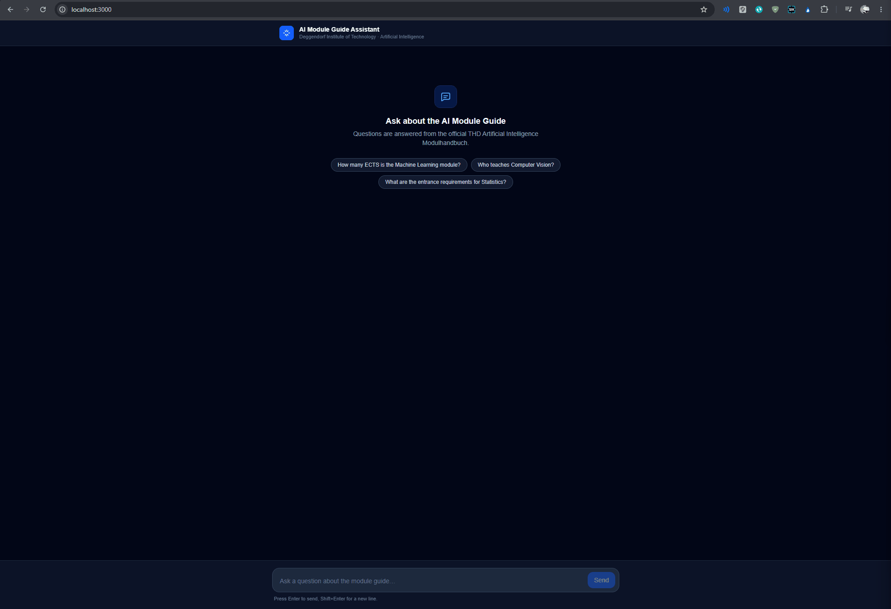
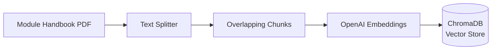
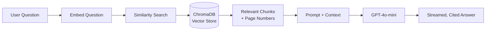

# Modulhandbuch AI Assistant

A full-stack Retrieval-Augmented Generation (RAG) application that provides semantic question-and-answer over a 200-page university module handbook. Instead of manually scrolling through the PDF, students can ask natural-language questions and receive streamed, source-cited answers grounded directly in the official handbook text.

The handbook used here is the **Artificial Intelligence (B.Sc.) Module Guide** of the Deggendorf Institute of Technology (THD).

---

## Demo

## Demo



## Architecture

The application implements a classic RAG pipeline split into three stages.

**1. Ingestion (offline, run once).** The source PDF is loaded and split into overlapping text chunks. Each chunk is converted into a vector embedding using OpenAI's embedding model, and the resulting vectors — along with their metadata (source filename and page number) — are stored in a ChromaDB vector database that persists to disk.

**2. Retrieval (per query).** When a user asks a question, the question itself is embedded and used to perform a similarity search against ChromaDB. The most relevant chunks are returned, carrying the page numbers they came from.

**3. Generation (per query).** The retrieved chunks are injected into a prompt as context, and GPT-4o-mini generates an answer constrained to that context. The answer is streamed back to the browser token by token via Server-Sent Events, and the page numbers of the supporting chunks are returned as citations so every answer is verifiable against the handbook.

### Ingestion pipeline



### Query pipeline



---

## Tech Stack

| Layer | Technology | Role |
|---|---|---|
| Language (backend) | Python 3.12 | Backend runtime |
| API framework | FastAPI | REST API and SSE streaming endpoint |
| RAG orchestration | LangChain | Chains together retrieval and generation |
| Vector database | ChromaDB | Stores and searches document embeddings |
| LLM & embeddings | OpenAI API (GPT-4o-mini) | Answer generation and text embeddings |
| Framework (frontend) | Next.js 15 | Chat user interface |
| Language (frontend) | TypeScript | Type-safe frontend code |
| Styling | Tailwind CSS | Dark-themed, responsive UI |
| Containerization | Docker & Docker Compose | One-command full-stack deployment |

---

## Getting Started

### Prerequisites

- [Docker](https://www.docker.com/) and Docker Compose installed
- An [OpenAI API key](https://platform.openai.com/api-keys)

### 1. Clone the repository

```bash
git clone https://github.com/<your-username>/modulhandbuch-ai-assistant.git
cd modulhandbuch-ai-assistant
```

### 2. Configure your API key

Create the backend environment file and add your OpenAI key:

```bash
# backend/.env
OPENAI_API_KEY=sk-your-real-key-here
```

This file is git-ignored and is never committed or baked into a Docker image.

### 3. Start the full stack

```bash
docker compose up --build
```

This builds and starts both services:

- **Backend API** — http://127.0.0.1:8000 (interactive docs at `/docs`)
- **Frontend UI** — http://localhost:3000

### 4. Run ingestion (first run only)

The vector store must be populated before the app can answer questions. Place the handbook PDF in `backend/data/docs/` (e.g. `modulhandbuch-ain-b-en.pdf`), then run ingestion inside the backend container:

```bash
docker compose exec backend python -c "from app.rag import ingest_pdfs; print(ingest_pdfs(), 'chunks ingested')"
```

The embeddings persist to `backend/data/chroma/`, so this step only needs to be run once — subsequent `docker compose up` runs reuse the existing vector store.

### 5. Ask a question

Open http://localhost:3000 and ask something like _"How many ECTS is the Machine Learning module?"_

---

## API Documentation

The backend exposes two endpoints. Interactive Swagger documentation is available at `http://127.0.0.1:8000/docs`.

### `GET /api/health`

A liveness probe that also reports configuration status. It never returns the API key itself.

**Example request**

```bash
curl http://127.0.0.1:8000/api/health
```

**Example response**

```json
{
  "status": "ok",
  "chat_model": "gpt-4o-mini",
  "embedding_model": "text-embedding-3-small",
  "openai_key_configured": true,
  "chroma_collection": "modulhandbuch"
}
```

### `POST /api/query`

Accepts a question and streams the answer back as Server-Sent Events.

**Request body**

```json
{
  "question": "How many ECTS is the Machine Learning module?"
}
```

**Example request**

```bash
curl -N -X POST http://127.0.0.1:8000/api/query \
  -H "Content-Type: application/json" \
  -d '{"question": "How many ECTS is the Machine Learning module?"}'
```

**Example response (SSE event stream)**

```
event: token
data: {"text": "The "}

event: token
data: {"text": "Machine Learning "}

event: token
data: {"text": "module is worth 5 ECTS."}

event: sources
data: {"sources": [{"filename": "modulhandbuch-ain-b-en.pdf", "page": 63}]}

event: done
data: {}
```

The stream emits many `token` events (one per generated chunk of text), followed by a single `sources` event listing the supporting handbook pages, and a final `done` event. On failure, an `error` event is emitted with a `message` field.

---

## Key Engineering Decisions

**Why ChromaDB.** ChromaDB runs embedded in the application process and persists to a local directory — no separate database server to provision or operate. For a single-handbook corpus this keeps the architecture simple and the whole stack reproducible with one `docker compose up`, while still providing fast vector similarity search.

**Why chunk overlap.** The handbook is split into chunks so that only the most relevant passages are sent to the LLM. A fixed-size split risks cutting a sentence — or a module's ECTS value — across a chunk boundary, leaving neither chunk with the full fact. An overlap between consecutive chunks ensures that information near a boundary appears intact in at least one chunk, which measurably improves retrieval quality.

**Why SSE streaming.** Generating a full answer takes several seconds. Server-Sent Events let the backend push tokens to the browser the moment the LLM produces them, so the user sees the answer appear progressively instead of waiting for a blank screen. SSE is a natural fit here because the data flows in one direction (server to client), making it lighter-weight than WebSockets for this use case.

**Why Python 3.12.** Development initially used Python 3.14, but its newness broke native package builds for ChromaDB and its C-extension dependencies, which did not yet ship compatible pre-built wheels. Pinning the project to Python 3.12 — both locally and in the backend Docker image — provided a stable, well-supported runtime with full dependency compatibility.

---

## What I Learned

Building this project end to end turned a set of separate technologies into a single working system, and most of the learning happened in the gaps between them. The hardest problems were integration problems rather than algorithmic ones: a CORS policy mismatch between the frontend and backend ports, and an SSE streaming bug where the server emitted `\r\n` line endings that the frontend parser did not expect. Containerizing the stack made the difference between "works on my machine" and a project anyone can run with one command, and it forced a clear understanding of how `localhost` means different things inside a container versus in the browser. Overall I came away with a concrete, practical grasp of how a production RAG pipeline fits together — from PDF ingestion to a cited, streamed answer.

---

## License

This project is released under the MIT License.
